# Unity ML-Agents 설치 및 학습 가이드

이 가이드는 Unity ML-Agents를 설치하고, 강화학습을 통해 에이전트를 학습시키는 전체 과정을 설명합니다. 

---

## 1단계: 아나콘다 설치 및 가상환경 생성

1. [아나콘다 다운로드 페이지](https://www.anaconda.com/products/distribution#download-section)로 이동합니다.
   - 메일 등록 화면이 나오면 **skip registration**을 눌러 다운로드 페이지로 바로 이동할 수 있습니다.
2. 운영체제(Windows, macOS, Linux)에 맞는 최신 버전을 다운로드합니다.
3. 설치 프로그램을 실행하고 지시에 따라 설치를 진행합니다:
   - "Just Me" 옵션을 선택합니다 (여러 사용자가 아나콘다에 접근할 필요가 없는 경우).
   - 설치하려는 폴더는 반드시 비어있어야 합니다.
4. 설치가 완료되면 시작 화면에서 **Anaconda Prompt**를 실행합니다.
5. 다음 명령어를 사용해 가상환경을 생성합니다. Python 버전은 **3.10.1에서 3.10.12 사이**여야 합니다.

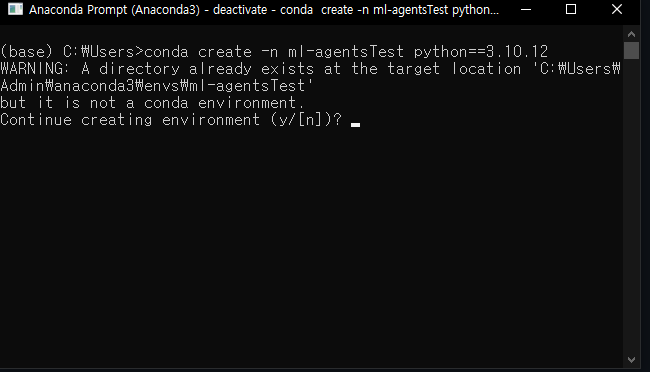
```
   conda create -n ml-agents python=3.10.12
```
6. 가상환경을 활성화합니다.
```
   conda activate ml-agents
```
---

## 2단계: ML-Agents 다운로드

Unity ML-Agents의 최신 안정 버전을 설치하려면 **Release 22**를 다운로드해야 합니다.

1. [Unity ML-Agents GitHub 페이지](https://github.com/Unity-Technologies/ml-agents?tab=readme-ov-file)로 이동합니다.
2. 아래로 내리면 **Realse22** 버전이 있습니다. 다운로드를 합니다.

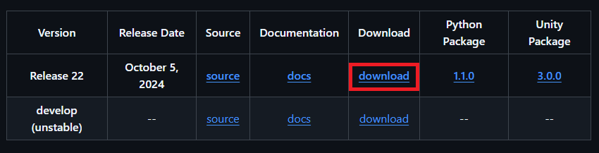

---

## 3단계: ML-Agents 설치

다운로드한 ML-Agents 파일을 설치하기 위해 다음 단계를 진행하세요.


1. 다운로드한 파일의 압축을 해제합니다.

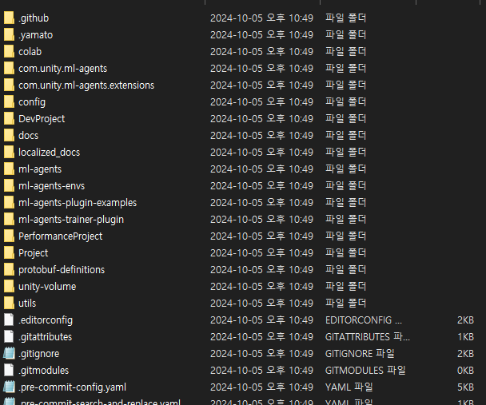

2. 터미널(또는 Anaconda Prompt)을 열고, 압축 해제한 폴더 내 **ml-agents-envs** 폴더로 이동합니다.
3. pip install -e . 명령어를 사용하여 ML-Agents 환경을 설치합니다.
4. **ml-agents** 폴더로 이동합니다.
5. pip install -e . 명령어를 사용하여 ML-Agents 패키지를 설치합니다.

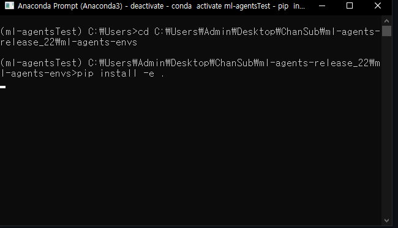

설치가 완료되면 ML-Agents가 성공적으로 설치된 것입니다.

---

## 4단계: Unity Hub 설치 및 ML-Agents 프로젝트 열기

Unity ML-Agents를 사용하기 위해서는 **Unity Hub**를 설치하고, ML-Agents 프로젝트를 열어야 합니다. 다음 단계를 따라 진행하세요.

1. [Unity Hub 다운로드 페이지](https://unity.com/download)로 이동하여 Unity Hub 설치 파일을 다운로드합니다.
2. 다운로드한 설치 파일을 실행하여 지시에 따라 Unity Hub를 설치합니다.


3. Unity Hub를 실행한 후, **Add** 버튼을 클릭하여 ML-Agents 압축 파일에 포함된 **Project** 폴더를 선택하여 엽니다.

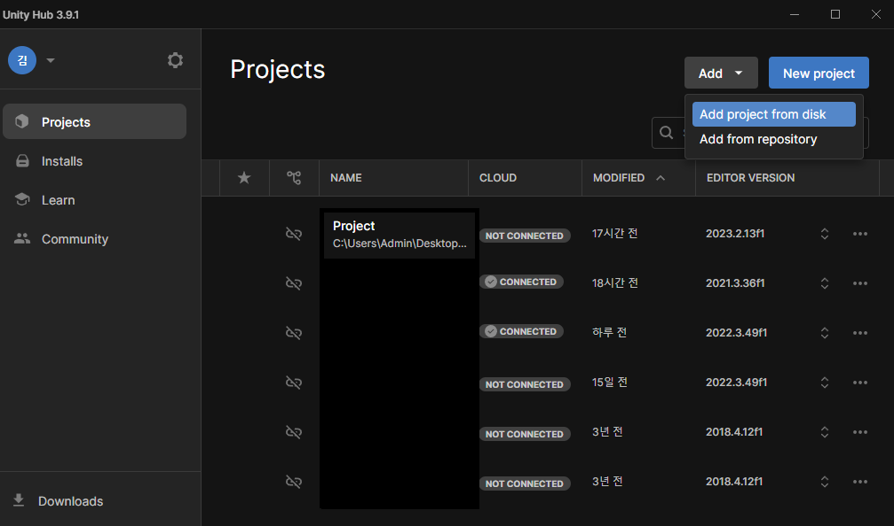

4. 선택한 Unity 프로젝트가 특정 Unity Editor 버전을 요구할 경우, **Install** 버튼을 통해 해당 Unity 버전을 설치하라는 메시지가 표시됩니다.
   - 이때 **Unity 2023.2.13f1** 버전을 설치하도록 선택합니다.

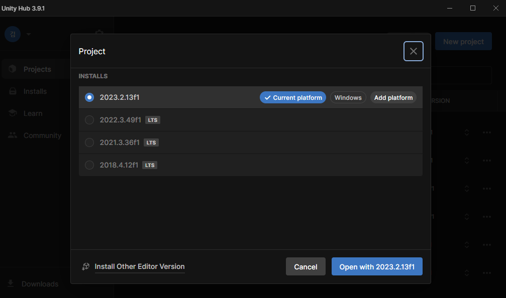

Unity Hub에서 프로젝트를 열고 해당 Unity 버전이 설치되면, 다음 단계에서 ML-Agents 환경 설정을 이어나갈 수 있습니다.

---

## 5단계: 강화학습된 에이전트 동작 확인 (DungeonEscape 예제)

이 단계에서는 ML-Agents를 통해 강화학습된 에이전트들이 어떻게 행동하는지 확인해보겠습니다. **DungeonEscape** 예제를 사용하여 진행합니다.


1. Unity Editor에서 **Project** 탭을 찾습니다.

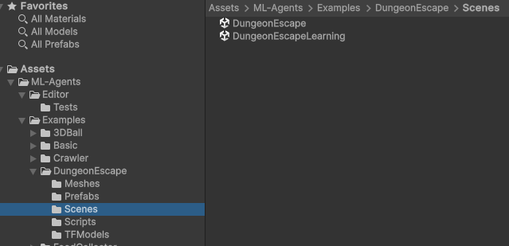

2. **DungeonEscape** 씬을 찾아 더블 클릭하여 엽니다.
   - 씬의 경로: `Assets\ML-Agents\Examples\DungeonEscape\Scenes`


3. 상단의 **재생** 버튼을 클릭하면, 에이전트들이 학습된 행동을 수행하는 모습을 확인할 수 있습니다.

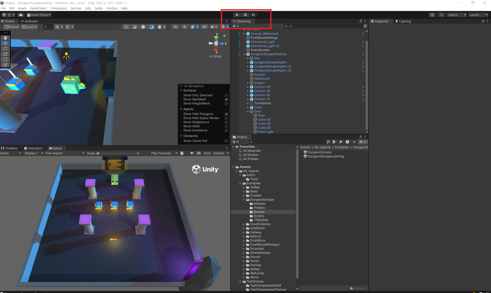

---

## 6단계: 에이전트 학습시키기

이 단계에서는 ML-Agents를 사용하여 에이전트를 직접 학습시키는 방법을 알아봅니다.


1. Unity Editor의 **Hierarchy** 탭에서 **BehaviorParameters** 컴포넌트를 사용하는 모든 오브젝트를 찾습니다.
   - **DungeonEscapeAgent**를 검색하여 해당 오브젝트들을 모두 찾고 일괄 선택합니다.

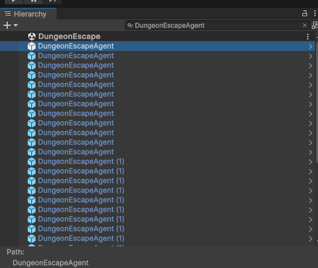

2. **Inspector** 창에서 **BehaviorParameters** 컴포넌트를 찾습니다.

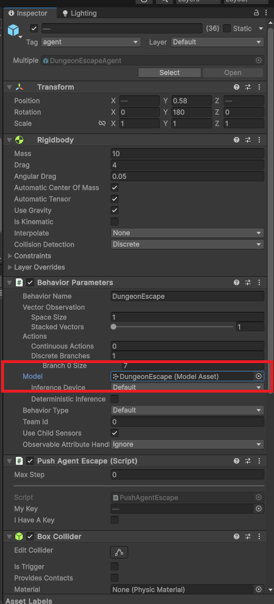

   - **Model** 옵션을 선택한 후 **delete** 버튼을 눌러 모델을 제거합니다.

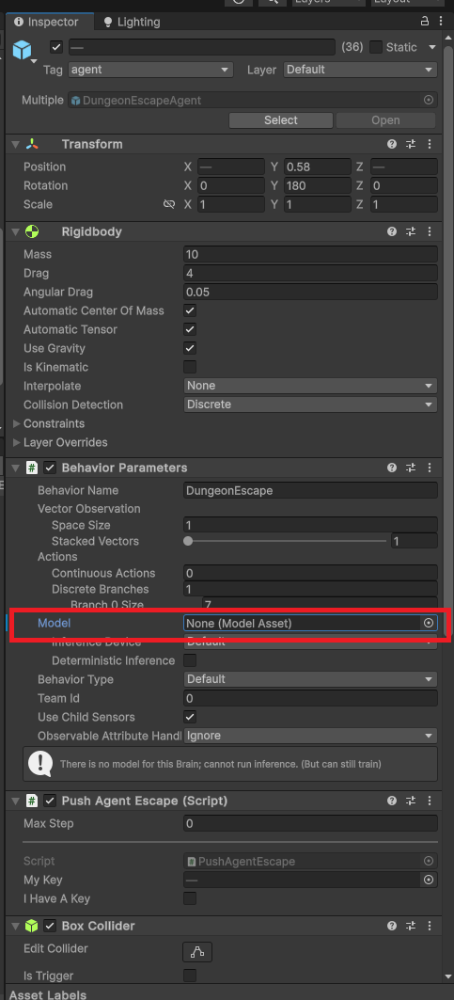

3. 활성화된 아나콘다 환경에서 다음 명령어를 입력하여 학습을 시작합니다.

```
   mlagents-learn config\poca\DungeonEscape.yaml --run-id=DungeonEscape --force
```
   - `config\poca\DungeonEscape.yaml`은 학습 설정 파일 경로입니다.
   - `--run-id=DungeonEscape`는 학습 세션의 이름을 설정한 예시입니다.
   - `--force`는 이전 학습 데이터가 있을 경우 이를 덮어쓰고 새로 학습을 시작하게 합니다.

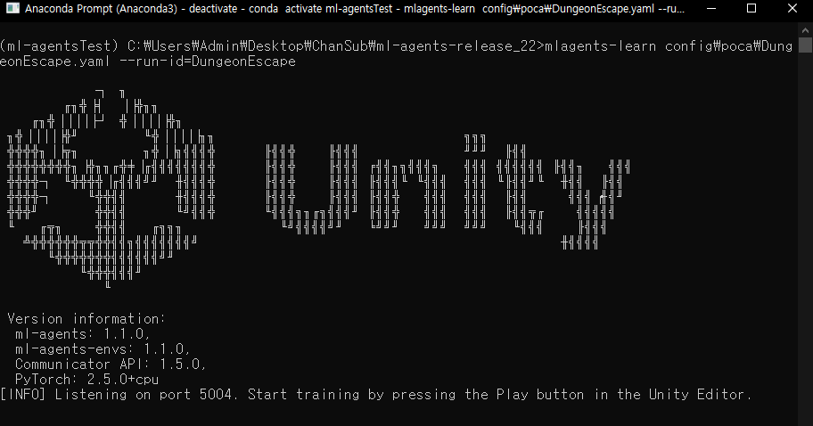

이 명령어를 입력하면 ML-Agents가 학습을 시작하며, Unity에서 학습 중인 에이전트의 행동을 실시간으로 확인할 수 있습니다.

---

## 7단계: 학습 완료된 모델 확인 및 Unity에 ONNX 모델 적용

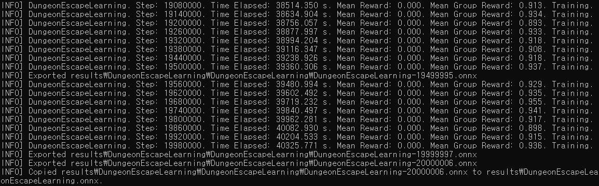

학습이 완료되면 **results** 폴더에 저장된 모델 파일을 Unity에 적용하여 에이전트가 학습된 행동을 수행하도록 설정할 수 있습니다. 이 단계에서는 ONNX 모델 파일을 가져와 Unity에 적용하는 방법을 설명합니다.


1. 학습이 완료되면 **results** 폴더 내에 `--run-id` 이름(DungeonEscape)으로 된 폴더가 생성됩니다.
   - 이 폴더 안에 `.onnx` 확장자를 가진 학습된 모델 파일이 포함되어 있습니다.

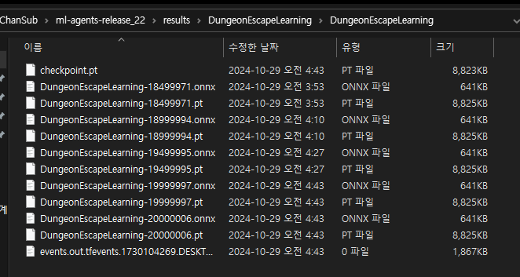

2. ONNX 모델 파일을 Unity로 가져오기 위해 해당 `.onnx` 파일을 복사합니다.

3. Unity Editor로 돌아가 **Assets** 폴더에 모델을 저장할 폴더(예: `ML-Agents\Examples\DungeonEscape\TFModels`)를 생성하고, 복사한 `.onnx` 파일을 붙여넣습니다.

4. **Hierarchy** 탭에서 학습된 행동을 수행할 에이전트를 선택하고, **Inspector** 창에서 **BehaviorParameters** 컴포넌트를 찾습니다.

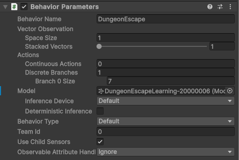

5. **BehaviorParameters** 컴포넌트에서 **Model** 항목에 방금 추가한 `.onnx` 모델 파일을 드래그하여 넣습니다.

이제 Unity에서 에이전트를 실행하면 학습된 모델을 기반으로 한 행동을 수행하게 됩니다. 필요한 경우 재생 버튼을 눌러 에이전트의 동작을 확인하세요.

---

## 8단계: TensorBoard로 학습 결과 확인하기

TensorBoard를 사용하면 학습 진행 상황과 결과를 시각적으로 확인할 수 있습니다. 주요 지표로 **Cumulative Reward**, **Group Cumulative Reward**, **Episode Length**를 통해 학습 성능을 모니터링할 수 있습니다.

1. 아나콘다 프롬프트에서 가상환경을 활성화합니다.
```
   conda activate ml-agents
```
2. 학습이 진행된 **results** 폴더를 기준으로 TensorBoard를 실행합니다.


```
   tensorboard --logdir=./results
```

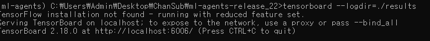

3. 명령어 실행 후, 출력된 로컬 주소(일반적으로 `http://localhost:6006`)를 웹 브라우저에 입력하여 TensorBoard 대시보드에 접속합니다.


4. TensorBoard에서 학습 과정 중 확인할 주요 지표:
   - **Cumulative Reward**: 에이전트가 에피소드 동안 얻은 총 보상을 나타냅니다. 학습이 성공적으로 진행될 경우 이 값이 점차 증가하는 것이 일반적입니다.
   - **Group Cumulative Reward**: 여러 에이전트로 구성된 그룹의 총 보상을 보여줍니다. 협력하는 에이전트 학습에서 전체 성과를 평가하는 데 유용한 지표입니다.
   - **Episode Length**: 각 에피소드의 길이를 의미하며, 목표를 더 빠르게 달성하기 위해 줄어드는 것이 바람직합니다.

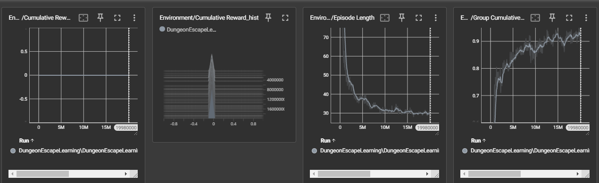

이제 TensorBoard를 통해 실시간으로 학습 진행 상황을 모니터링할 수 있습니다.
